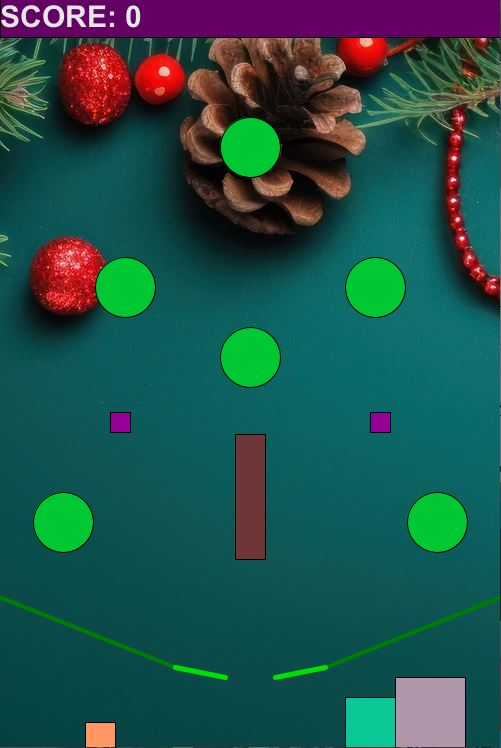
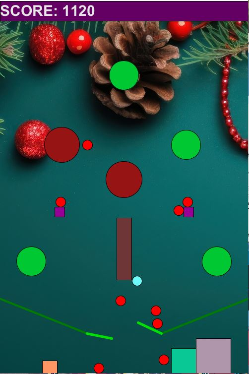
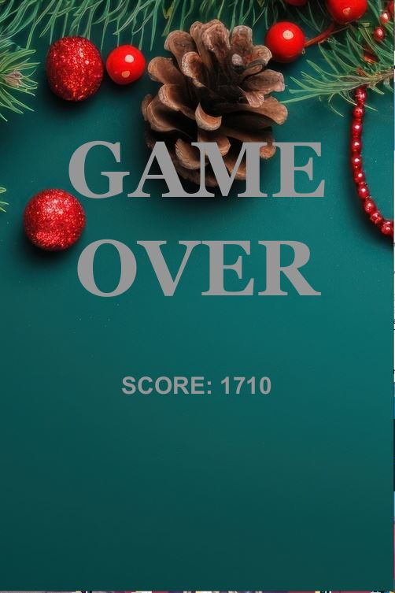

# 5611-Project1 Pinball Game

**Project Overview video:**


---

**Timestamps and List of attempted features:**
----
**Pinball Game:** 0:00 - 1:08

A pinball game was created with working flippers, pause, play and restart functionality. When the game starts, all balls will fall from the top and begin colliding with other objects in the scene. On losing all the given balls, the game will end and show the ending screen with your final score. The flippers rotate around their base point, and gain rotational velocity when they move. This is converted to linear velocity when applied in flipper collision, which also takes into account the distance from the rotation point.

---
**Score Display:** 0:18 - 1:08

The score is displayed at the top during the game, and once again on the end game screen. Pinball to circle-obstacle collision gives 20 points, while pinball to brown-rectangle gives 10. No other obstacles give points.

---
**Circular Obstacles:** 1:19 - 1:49

There are six circle objects that all start out as green.

---
**Reactive Obstacles:** 1:19 - 1:49

The circle objects are reactive and upon collision with pinball will increase in size and turn red. After the collision, the circle will gradually shrink back to the original size and then turn green.

---
**Sound Effects:** 1:28 - 1:37

The circle objects also play a "ding" sound affect with struck by a pinball. This was implemented using the Sound library.

---
**Line-Segment/Polygon Obstacles:** 1:50 - 2:48

There are both boxes and line-segment obstacles. The line-segments take the form of the flippers and its arms, while the box objects appear as obstacles in the scene. 

---
**Multiple Material Types:** 1:51 - 2:48

The box obstacles do have multiple material types. The brown-rectangle reduces the mass of the colliding pinball, and also changes the pinball color to blue. This gives the effect of reduced gravity on the pinball. Once the pinballs turn blue, colliding with the circle obstacles will reset their mass and color back to red. The pink boxes have a stick property to them, and when a pinball collides with it, it will get stuck to the box for the rest of the game.

---
**Textured Background:** 2:49 - 3:03

The background is textured a festive christmas theme, and matches the layout of the objects that resembles a christmas tree with presents.

---
**Basic Pinball Dynamics:** 3:04 - 3:40

To simulate basic pinball dynamics, a gravitational acceleration was combined with the pinball mass to create a gravitational force, which was then applied to the pinballs velocity. This created a more realistic simulation of a ball falling, as it speeds up as it falls. Collisions were calculated using the initial velocities and masses of both objects, in order to determine the final velocities and directions that they will bounce off. A coefficient of restitution was also applied to the resulting velocity to simulate kinetic energy lost in the collision.

---
**Multiple Balls Interacting:** 3:18 - 3:40

There are ten pinballs dropped into the scene when the game starts. Throughout the game they will collide with each other and other obstacles in the scene.

---

Image Captures
---

|Game Start Screen:          | Mid Game Screen:          |Game Over Screen:    | 
|-------------------------|-------------------------|-------------------------------------|
| |  |    |          

---

Difficulties
---
One point of difficulty for me was getting the flipper rotation to work correctly. A lot of times the flipper hitbox was larger or displaced from the flipper displayed in the scene. I realized that I was using rotate() incorrectly, as it rotates the whole scene around the center point. To fix this I used the translate function, to set the origin of the scene to the flippers rotation points, before drawing. In order to keep these changes only affecting the flipper, I used pushMatrix and popMatrix so that the operations wouldn't affect anything else in the scene.

Another issue I had was the pinballs gaining an incredible amount of speed and phasing through my obstacles, particularily the thinner ones like the flipper arms or brown-rectangle. The fact it happened at high speeds told me it was less likely to be a problem with my collision detection, but with the time step where the scene is updated. In one time step if would be on one side of the object and on the other side in the next, due to how fast it was going. I implemented multiple ways to prevent this. First I decreased dt, delta time, so that the time step between position updates was smaller. In theory this would allow for more steps to be made, and give more chances to pick up on a collision. The second prevention was to simply put a hard cap on the velocity that a pinball can reach. Through trial and error I picked a value that kept the pinballs from moving too fast while also keeping their movement reaistic.

---
***Source code download:*** <a href= "CSCI5611_Project_1.pde" download>Download Game Code</a>

All processing code was written by me. Included in the above file is a collision library, a Vec2 library to handle 2D vectors, object classes to hold obstacle information (Circles,Boxes,Lines), and the code for the pinball game. The Vec2 library was modified from Professor Guy's given version. The processing <a href="https://processing.org/reference/libraries/sound/index.html"> Sound Library </a> was used to implement the sound effects for the game. Other code models and structuring were used from Professor Guy's slides and code examples as a basis for things like implementing gravity, collision detection and calculating new velocity/direction, and flippers. <a href="https://processing.org/reference/"> Processing documentation </a> was also referenced to explore built in functions and their functionalities (Some examples are the PImage and PFont classes for texturing and adding text to the scene). 

The background texture was sourced from: <a href="https://www.vecteezy.com/photo/26750034-christmas-fir-branch-background "> Vecteezy </a>

The ding sound effect was sourced from:<a href="http://soundjax.com/ding-1.html "> Soundjax </a> 

---
